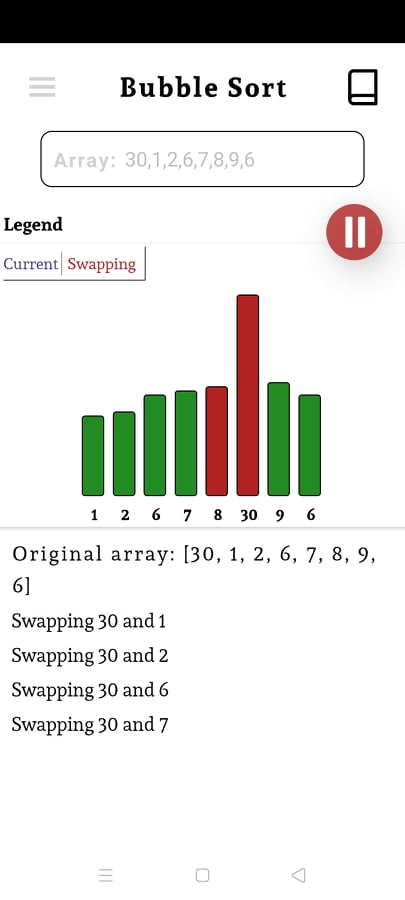
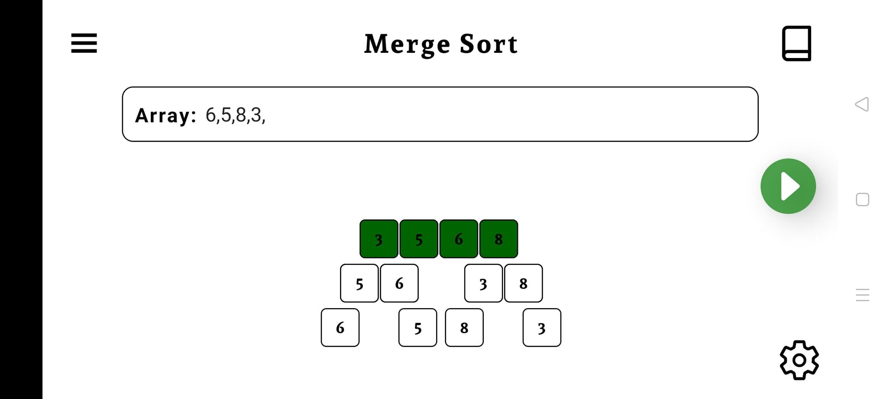

# Sorting-Visualizer

A mobile application created using React Native but tested only on android device. 
The goal of this application was a deep understanding of sorting algorithms(bubble, quick and merge sort). The application provides two ways of visualization: charts and snapshots.

<table style="width:100%">
  <tr>
    <th>Visualization using Charts</th>
    <th>Visualization using Snapshots</th>
  </tr>
  <tr>
    <td></td>
    <td></td>
  </tr>
</table>

Snapshots offers two visualization methods
 
<ol>
  <li>Using a timer (as in the pictures)</li>
  <li>Manual with buttons</li>
</ol>
<a href="https://github.com/Sven2219/Sorting-Visualizer/tree/master/images">For more images click here</a>

<a href="https://github.com/Sven2219/Sorting-Visualizer/tree/master/src">Source code</a>
